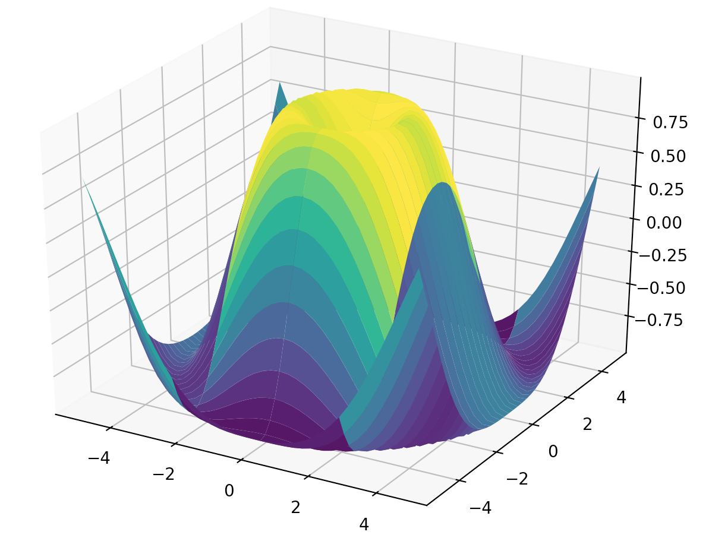
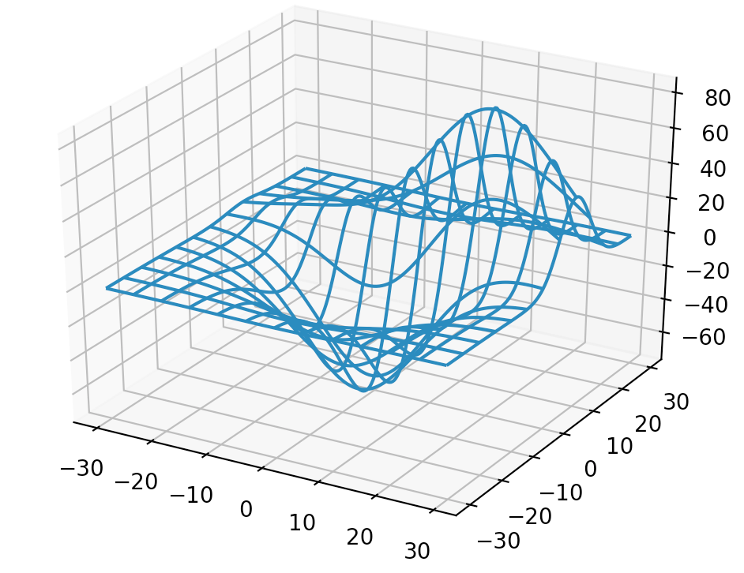
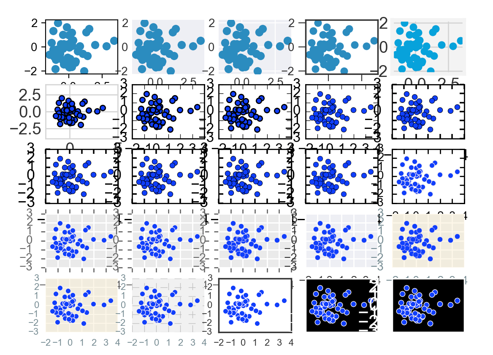
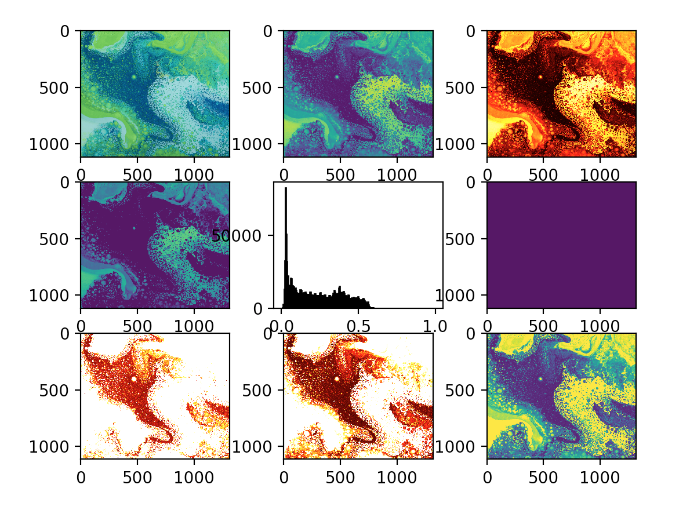
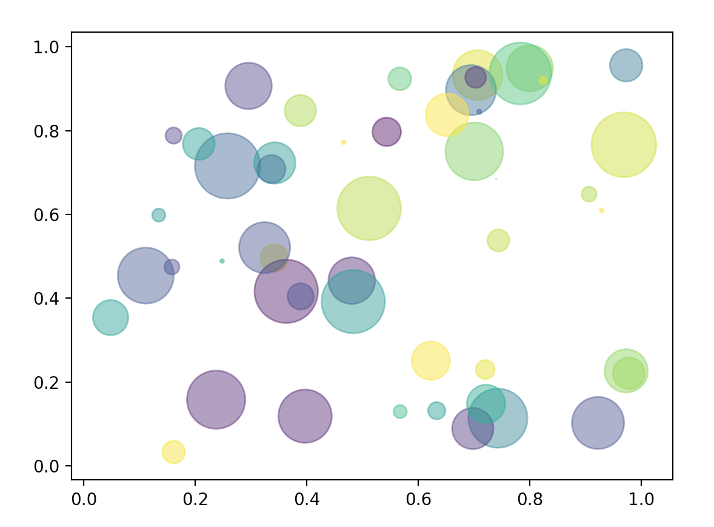
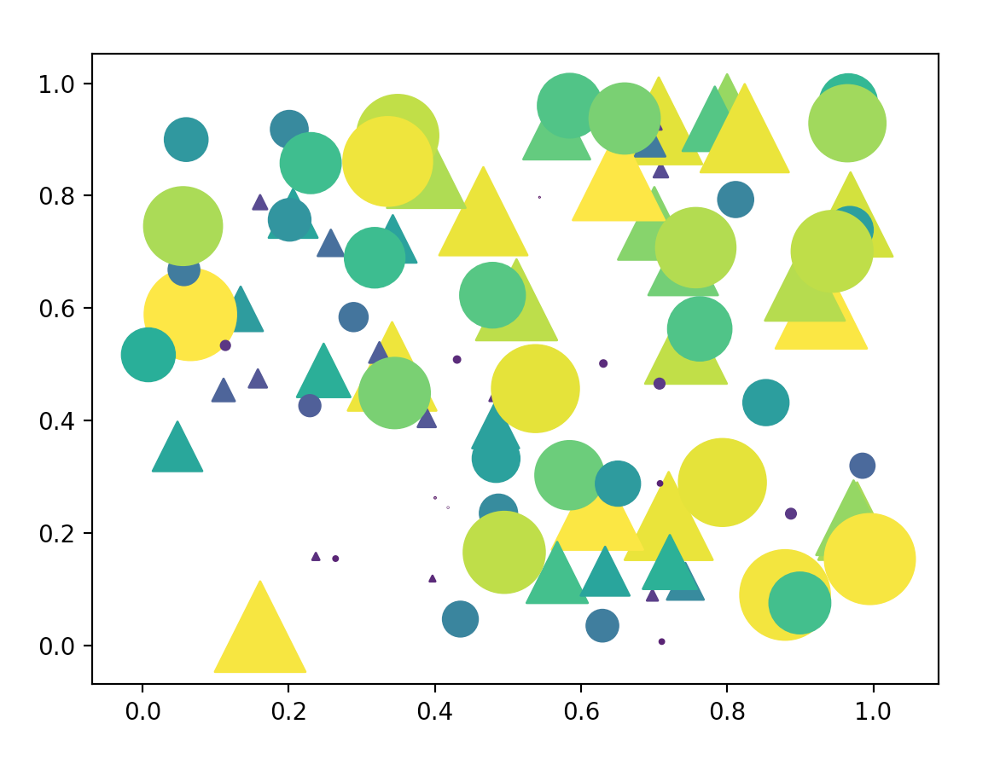
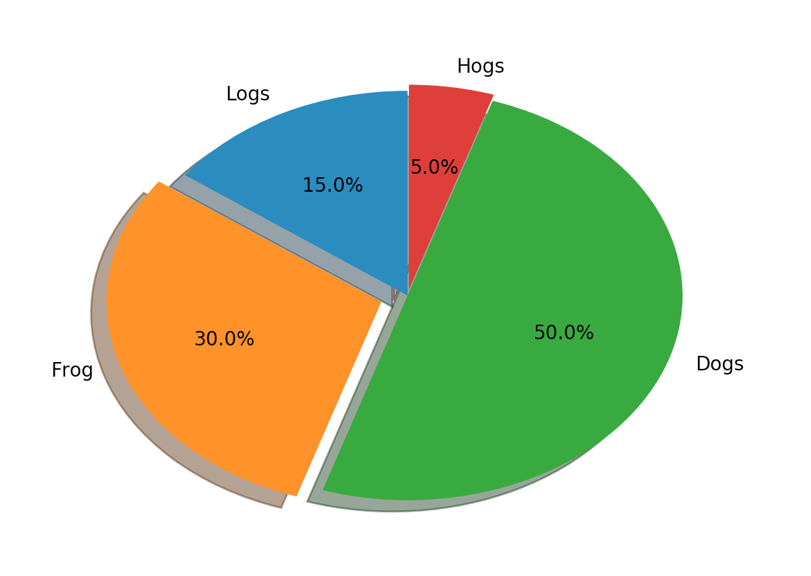
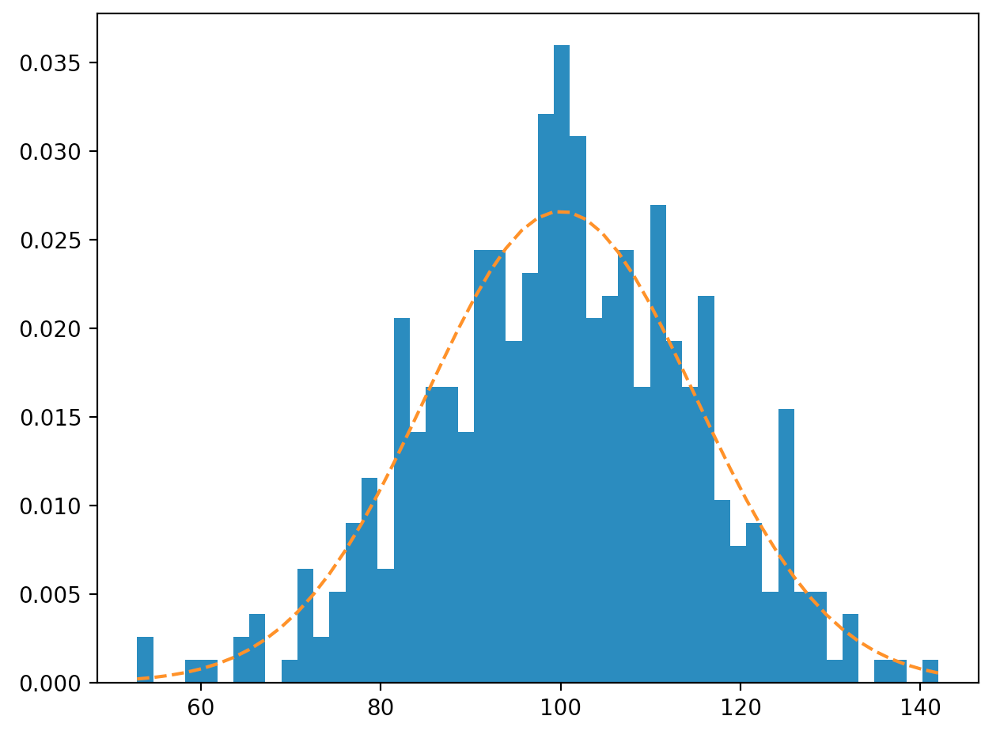

# matplotlib examples

<h2>Table of Content</h2>
<ul>
	<li><a href="#3d">3D
		<ul>
			<li>first try at Mplot3d</li>
		</ul>
	</a></li>
	<li><a href="#style">Styles</a></li>
	<li><a href="#imgTut">Image Tutorial on matplotlib.org</a></li>
	<li>Line plots</li>
	<li>Subplot</li>
	<li><a href="#scatter">Scatter plot</a></li>
	<li><a href="#scatter">Pie Chart</a></li>
	<li><a href="#hist">Histogram</a></li>
</ul>

<h3 id="3d">3D</h3>
 
 

<h3 id="style">Styles</h3>

<h3 id="imgTut">Image Tutorial on matplotlib.org</h3>

<h3 id="scatter">Scatter plot</h3>
 
 

<h3 id="scatter">Pie chart</h3>

<h3 id="hist">Histogram</h3>

